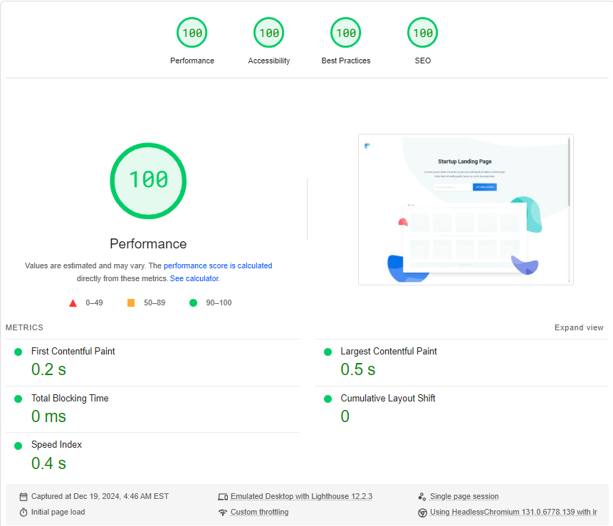

## Live Demo

[Click here to see the live demo](https://agency-analytics-kappa.vercel.app/) hosted on [Vercel](https://vercel.com/)

## Google Page Speed



## Running the project locally

### .env

This codebase requires the use of a `.env` file for the Contentful access keys. In the root of the codebase you will find a file called `.env.example` which contains all of the necessary information with the exception of the keys.

Once you have obtained your keys, run the development server:

```bash
npm run dev
# or
yarn dev
# or
pnpm dev
# or
bun dev
```

Open [http://localhost:3000](http://localhost:3000) with your browser to see the result.

## Built With

- [Next.js](https://nextjs.org)
- [React](https://reactjs.org/)
- [TailwindCSS](https://tailwindcss.com/)
- [Motion](https://motion.dev/)
- [GraphQL](https://graphql.org/)
- [Contentful](https://be.contentful.com)
- [Vercel](https://vercel.com/)
